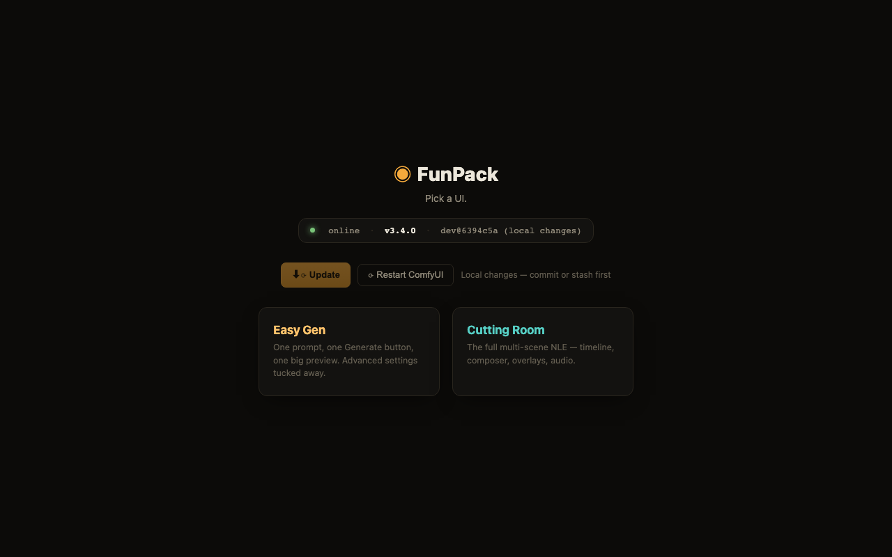
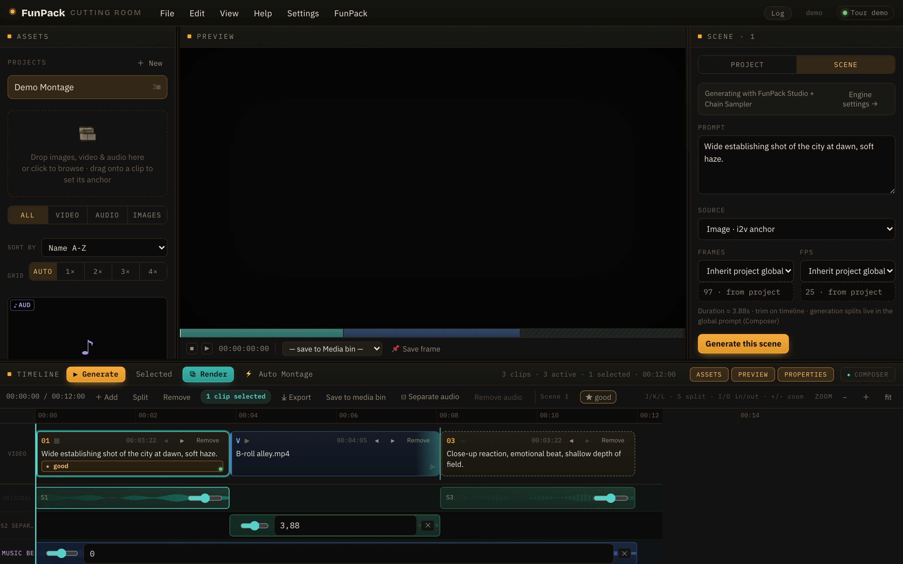
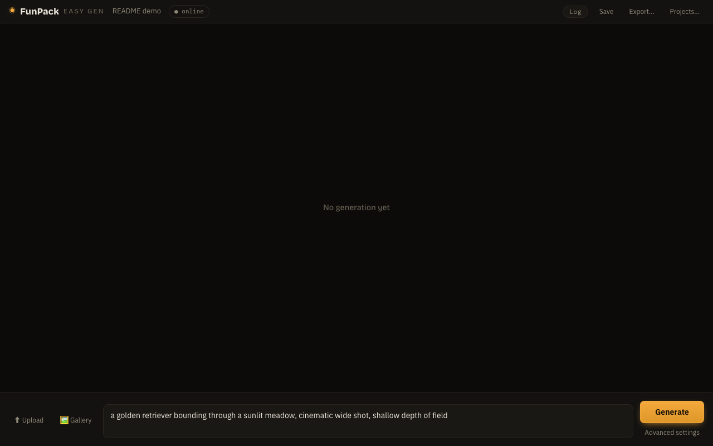
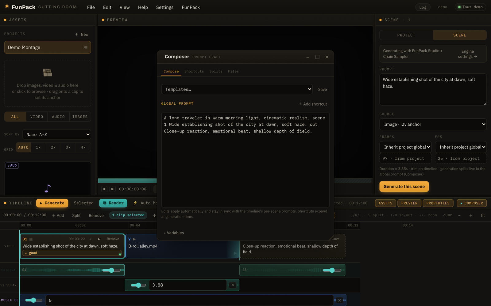
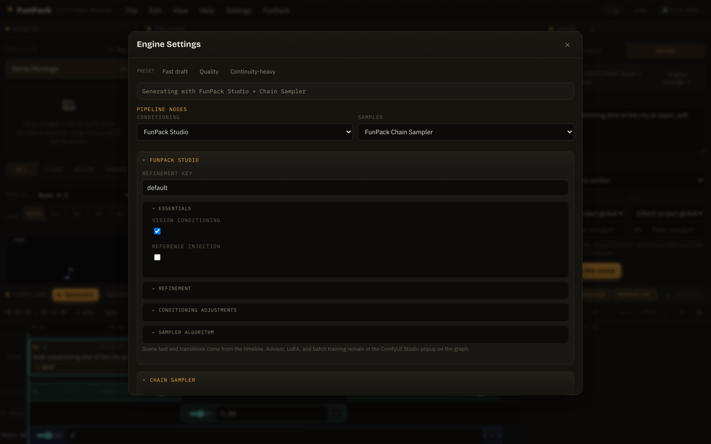

# ComfyUI-FunPack

**FunPack turns ComfyUI into an AI movie studio.** At its heart is the **Cutting Room** — a full browser-based non-linear video editor where you write a script, arrange scenes on a real timeline, and generate a complete montage with one click. Behind it sits a self-improving generation engine: rate your clips and FunPack learns your taste, steering future generations toward what you liked. The nodes that power all of this (Studio, Video Refiner V2, the LTXAV Scene Chain Sampler, and more) remain fully usable in classic ComfyUI graph workflows with WAN, HunyuanVideo, LTX, and similar models.

  &nbsp;
  &nbsp;
  

> [!IMPORTANT]
> FunPack is the project maintained by one person. Finding bugs, or features not working as intended, all alone - is nearly impossible - especially in an advanced piece of software like Editor. I've tried my best to make setup and acquaintance with FunPack as easy as possible, introducing multiple failsafes, but I can't envision how exactly you will use it.
>
> With this said - FunPack is provided "as is". Stable, uninterrupted work is NOT guaranteed even on main branch. But that doesn't mean bugs won't be fixed - you are free to file a bug report and I will most likely fix it in the nearest time.

## What it looks like

Opening `/funpack/` inside ComfyUI lands you on the **Hub** - a small picker between FunPack's two browser UIs, plus at-a-glance version/update status.

### Two UIs, one engine

One app at `/funpack/`, with a mode switch beside the wordmark:

- **Editor** - the full multi-scene non-linear editor: a real timeline with per-scene prompts, ratings and audio lanes, a program monitor, a media bin, and every Engine/Studio knob a click away. This is where rating-driven learning (refinement keys, value guidance, taste steering) lives.
- **Simple** - media bin, preview and one prompt. The timeline, ratings and advanced settings are hidden, not disabled: switching back shows them exactly as they were.

| Editor mode - timeline, preview monitor, media bin, and scene inspector | Simple mode - media bin, one prompt, one Generate button |
| --- | --- |
|  |  |

| The Composer - global prompt, shortcuts, split markers, `$variables` | Engine Settings - Studio + Chain Sampler knobs without touching a graph |
| --- | --- |
|  |  |

Want a guided look at every panel? Open the editor and press **Help ▸ Welcome tour** - the same tour also auto-generates a full annotated gallery and walkthrough video via [`tools/showcase`](tools/showcase).

## Dev and other non-main branches

The `dev` branch is intended for testing unfinished changes, implementing new logic and basically, flipping everything just because I can. It can be broken, renamed, or changed without warning.

Use only `main` if you want the most stable version of FunPack. Bug reports based on `dev` version will be ignored.

From time to time other short-lived branches may appear for the most advanced yet most breaking changes and features (e.g. a large rework in progress). I do not recommend using any non-`main` branch unless it's strictly necessary for your workflow — any sort of stability is not guaranteed, and such branches can be force-pushed or deleted at any time.

## Versions

Each major version carries a codename, shown in Settings ▸ About. 3.x is
**"Auspicious Asparagus"**.

### Version 3.0 — Cutting Room and development direction

FunPack **3.0** introduces the **Cutting Room** — a dedicated montage editor at `/funpack/` inside ComfyUI. It is the primary surface for building multi-scene projects, previewing on a real timeline, and driving FunPack Studio + the LTXAV Scene Chain Sampler without wiring a graph by hand.

Going forward, **new features and UX work target the Cutting Room frontend**. The classic ComfyUI node popups (Studio, Refiner V2, Scene Chain Sampler, and other pre-3.0 nodes) remain fully usable but will receive **bugfixes only** — no significant UI reworks unless a fix requires it. If you live in ComfyUI graphs, nothing breaks; if you want the full montage workflow, use the Cutting Room.

**3.0.1** adds per-shortcut **refinement keys** (a shortcut can mark which key it trains, with per-scene multi-key steering and a timeline preview of the keys each scene will use) and fixes Cutting Room splitting/anchor bugs — see the [CHANGELOG](CHANGELOG.md).

**3.1.1** adds prompt **`$variables`** and global-prompt **templates** in the Composer, a
cross-shot **JoyAI-Echo** audio/video memory mode, contrastive-pair **FreeSliders**, and a
seed-routing **path-outcome planner** that steers future generations away from disliked paths —
see the [CHANGELOG](CHANGELOG.md) for the full list.

**3.1.2** fixes a Cutting Room regression where splitting a clip could undo itself (the second
half got pushed out as if a full-length clip had been appended) — see the
[CHANGELOG](CHANGELOG.md).

**3.1.3** brings several **experimental sampler techniques** (ALG anchor de-staticking and
Momentum Guidance on Distilled Flow, Bounded Attention for multi-subject scenes), an **Auto
Montage** trailer builder, a **Temp files** browser, **reconnect-after-reload** for in-flight
generations, and a Blackwell (sm_120) guide-scene crash fix — see the [CHANGELOG](CHANGELOG.md)
for the full list.

**3.4.0** brings **Easy Gen** to near feature-parity with the Cutting Room for the workflows
it targets: shortcut/transition library import/export, the full Engine settings panel
(including Best-FaceID), a Gallery picker with a one-click continuity pin, Save/Export buttons,
and several bugfixes (a bypass toggle that could silently do nothing, a state-sync bug that
could revert Models & Pipeline edits, and more) — see the [CHANGELOG](CHANGELOG.md) for the
full list.

**3.4.1** adds a **second sampling pass** on the Chain Sampler — give it a schedule and every
scene is sampled twice, with an optional latent sharpen/2× upscale between the passes — plus
**cut the opening** for i2v scenes (keep the anchor's identity transfer at full strength, then
cut the reference still out of the finished clip), **context windows** for scenes longer than
the model's comfortable window, and a progress readout that says which scene and which pass is
running. Context windows, which never actually worked before, are fixed — see the
[CHANGELOG](CHANGELOG.md) for the full list.

**3.5.0** adds a **second model family**: MiniMax H3 alongside LTX-2 / LTXAV. A project picks a
family, and everything downstream follows from that choice — which nodes the graph emits, which
model files the setup asks for, which sampler settings are even applicable, and what counts as a
valid scene length. Nothing about LTX-2 changes.

**3.5.1 "Auspicious Asparagus"** is the first release with a codename, and a
compatibility-and-polish pass on top of 3.5.0. **LTX-2.5** works — it reuses the same model
classes behind new config flags, so almost everything binds unchanged, and the two places that
would have broken *silently* are fixed. **Settings ▸ About** now reports the machine ComfyUI
runs on (chip, memory, GPU and VRAM, disk, OS, Python, torch, and which fast-attention backend
is actually installed), which is the thing you want at a glance on a fresh rental. **ALG** runs
on any sampler rather than only FunPack's Distilled Flow, and its two duplicate switches became
one. **`cut_opening_frames`** no longer leaves a noisy first frame — it cuts decoded pixels
instead of latents, and the count is now exact. See the [CHANGELOG](CHANGELOG.md) for the full
list.

See [`docs/MovieEditor.md`](docs/MovieEditor.md) for complete Cutting Room documentation.

## Installation

FunPack is available on Comfy Registry and can be installed in any of these ways:

1. With `comfy-cli`:
   `comfy node install ComfyUI-FunPack`
2. With git, inside your `ComfyUI/custom_nodes` directory:
   `git clone https://github.com/digital-garbage/ComfyUI-FunPack`
3. With ComfyUI-Manager:
   Open `Custom Nodes Manager`, search for `ComfyUI-FunPack`, and click `Install`.

## Dependencies

FunPack includes a [`requirements.txt`](requirements.txt) file for its Python dependencies.

Install them with:

`pip install -r requirements.txt`

FunPack uses your existing ComfyUI/PyTorch install. The expected baseline is `transformers >= 5.0.0`

`hpsv3` is optional and only used by the `FunPack StoryMem Keyframe Extractor` quality filter, so it is not installed by default.

Install it manually only if you need that feature:

`pip3 install hpsv3 --no-build-isolation`

## Important Note About `hpsv3`

Installing `hpsv3` can break `Prompt Enhancer` and `Story Writer`, because `hpsv3` depends on a `transformers` version that conflicts with the version those LLM-based nodes require.

FunPack's LLM nodes require `transformers >= 5.0`. The version required for `hpsv3` is strictly `transformers==4.45.2`. Installing any version different from it will result in broken quality detector.

If you install `hpsv3`, use `--no-build-isolation`. Optionally, specify the exact version - `pip install transformers==4.45.2 --no-build-isolation`.

## Documentation

Per-node documentation is available in the [`docs`](docs) folder.

Start with:

- [`docs/MovieEditor.md`](docs/MovieEditor.md) for the FunPack Cutting Room (Movie Editor)
- [`docs/FunPackVideoRefinerV2.md`](docs/FunPackVideoRefinerV2.md) for `FunPack Video Refiner V2`
- [`docs/FunPackVideoRefinerV2QuickGuide.md`](docs/FunPackVideoRefinerV2QuickGuide.md) for a short Discord-friendly Refiner V2 guide
- [`docs/FunPackLTXAVSceneChainSampler.md`](docs/FunPackLTXAVSceneChainSampler.md) for split-scene LTXV/LTXAV continuation
- [`docs/FunPackLoraWorkflow.md`](docs/FunPackLoraWorkflow.md) for the LoRA/refiner helper workflow

Version history is available in [CHANGELOG.md](CHANGELOG.md).

## Feedback

If you have suggestions, questions, or ideas for new features, feel free to open an issue or submit a pull request.

## Intent

FunPack is a hobby project, provided to you by a fellow AI enthusiast who "lives in the trenches" and knows exactly what people seek in video/audio generation workflows.

FunPack is provided under GNU General Public License V3, which gives you broad rights to use, modify and distribute the original/modified version of it as long as the original license text is included. FunPack places no limitations on types of content you can generate by using it, meaning both SFW and NSFW content are fine as long as you don't violate your local laws. GPLv3 does not grant you rights for such violations.

However, I do not endorse using FunPack and/or demonstrating it alongside morally and legally questionable/prohibited content, including:
- Non-consensual explicit depiction of a real person;
- Explicit depiction of minors;
- Depiction of violence and gore targeted at a real person.

I do not provide support to users who use FunPack in such cases, and in case I detect it, any support will be immediately ceased.

Thanks for understanding.

## Thank you

I express my deepest gratitude to:

- OpenAI and ChatGPT Codex;
- xAI and Grok Build;
- Anthropic and Claude Code;
- Team Cursor and Composer model;
- DeepSeek team and model;
- Google and Gemini;
- Lightricks and LTX-Video model;
- [ComfyUI-LTXVideo](https://github.com/Lightricks/ComfyUI-LTXVideo) — LTX model loaders and nodes used by the built-in Cutting Room pipeline;
- [ComfyUI-VideoHelperSuite](https://github.com/Kosinkadink/ComfyUI-VideoHelperSuite) — video combine and helper nodes for montage export;
- [ComfyUI-KJNodes](https://github.com/kijai/ComfyUI-KJNodes) — utility nodes used by the built-in pipeline;
- [OpenCut](https://github.com/opencut-app/opencut-classic) — the in-browser non-linear video editor whose UI and interaction patterns inspired the FunPack Movie Editor;
- ComfyUI and its whole community.

Without all of you, this project would've been impossible.

With <3

DigitalGarbage
